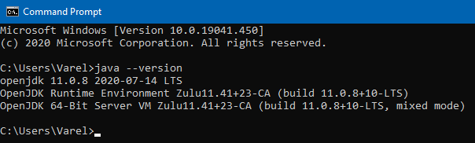
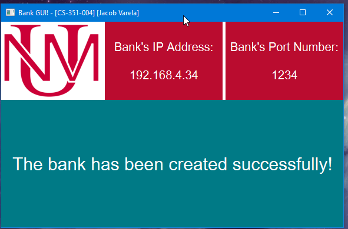
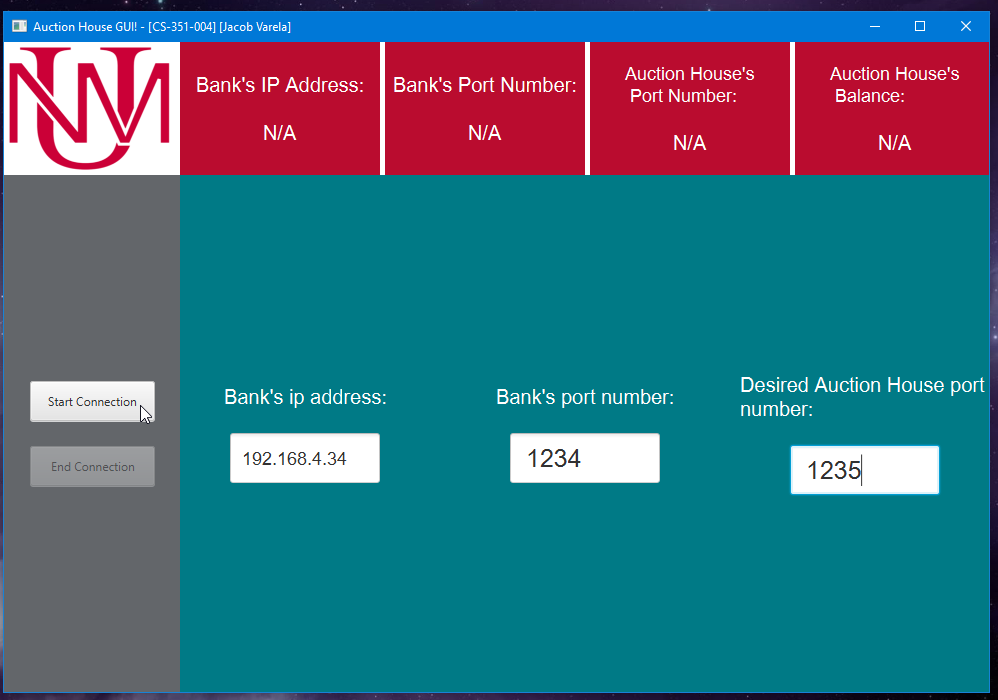
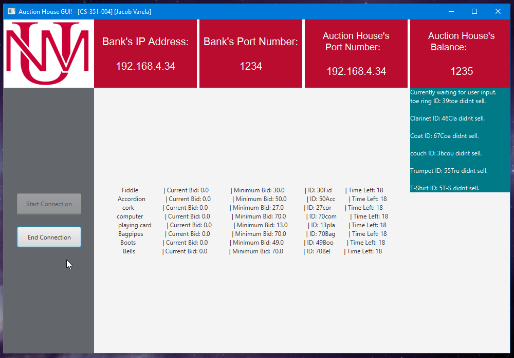

<!-- PROJECT LOGO -->

# Auction House Project

<!-- TABLE OF CONTENTS -->
## Table of Contents

* [About the Project](#about-the-project)
  * [Built With](#built-with)
  * [Document Structure](#document-structure)
  * [Project Requirements](#project-requirements)
  * [Design Choices](#design-choices)
* [How to run this program](#how-to-run-this-program)
* [Usage](#usage)
* [Contact Info](#contact-info)

<!-- ABOUT THE PROJECT -->
## About The Project

<!--[![Product Name Screen Shot][product-screenshot]] -->

*  In this program I am simulating a system of multiple auction houses selling items, multiple agents buying items, and a bank to keep track of everyone's funds.
*  The bank will exist on one machine at a static known address, the agents and the auction houses will be dynamically created on other machines. 

### Built With
* [Java 11 (LTS)](https://www.azul.com/downloads/zulu-community/)
 

### Document Structure:
Document                 | Description
--------------------     | --------------------
README.md                | Text file that contains information about the project.
.gitignore               | Contains the filetypes that will be excluded from the project repository.
 src/                    | Contains all the class files.
 docs/                   | Document directory that contains the design documents.
 resources/              | Contains images for the README  
 auctionHouse.jar        | .jar file containing the Auction House.
 agent.jar               | .jar file containing the Agent.
 bank.jar                | .jar file containing the Bank.

### Project Requirements
#### Bank:
* The bank is static and at a known address. You’ll start this program before
either agents or auction houses. (The bank is a server and the agents and
auction houses are its clients.)
Both agents and auction houses will have bank accounts. When an agent bids
on or or is outbid in an auction, the bank will block or unblock the appropriate
amount of funds, at the request of the auction house. When an agent wins an
auction, the bank will transfer these blocked funds from the agent to the auction
house account, at the request of the agent.
Auction houses provide the bank with their host and port information. The
bank provides the agents with the list of the auction houses and their addresses
so the agents will be able to connect directly to the auction houses.
Aside from possibly some initial configuration, the bank is not expected to
interact with the user, though you may chose to have some status messages
printed to verify what is happening.
You may assume the bank program will remain running throughout the
simulation. You don’t have to make agents and auction houses robust to the
bank program terminating.

### Auction House:
* Each auction house is dynamically created. Upon creation, it registers with the
bank, opening an account with zero balance. It also provides the bank with its
1
host and port address1
, so the bank can inform the agents of the existence of
this auction house. (An auction house is a client of the bank, but also is a server
with agents as its clients.)
It hosts a list of items being auctioned and tracks the current bidding status
of each item. Initially, the auction house will offer at least 3 items for sale.2 As
the items are sold, new items will be listed to replace them. (The items for sale
may be scripted, read in from a configuration file, programmatically generated,
etc.)
Upon request, it shares the list of items being auctioned and the bidding status with agents, including for each item house id, item id, description, minimum
bid and current bid.
The user may terminate the program when no bidding activity is in progress.
The program should not allow exit when there are still bids to be resolved. At
termination, it de-registers with the bank. An auction house terminating should
not break the behavior of any other programs in the system.
Aside from possibly some initial configuration and requesting the program
to exit when safe to do so, an auction house is not expected to interact with
the user, though you may chose to have some status messages printed to verify
what is happening.

### Auction Rules:
* The auction house receives bids and acknowledges them with a reject or accept
response.
When a bid is accepted, the bank is requested to block those funds. In fact,
the bid should not be accepted if there are not enough available funds in the
bank.
When a bid is overtaken, an outbid notification is sent to the agent and the
funds are unblocked.
A bid is successful if not overtaken in 30 seconds.3 When winning a bid, the
agent receives a winner notification and the auction house waits for the blocked
funds to be transferred into its account.
If there has been no bid placed on an item, the item remains listed for sale.

### Agent
* Each agent is dynamically created. Upon creation, it opens a bank account by
providing a name and an initial balance, and receives a unique account number.
(The agent is a client of both the bank and the auction houses.)
The agent gets a list of active auction houses from the bank. In connects to
an auction house using the host and port information sent from the bank. The
agent receives a list of items being auctioned from the auction house.
When an agent makes a bid on an item, it receives back one or more status
messages as the auction proceeds:
    - acceptance – The bid is the current high bid
    - rejection – The bid was invalid, too low, insufficient funds in the bank,
etc.
    - outbid – Some other agent has placed a higher bid
    - winner – The auction is over and this agent has won.
The agent notifies the bank to transfer the blocked funds to the auction
house after it wins a bid.
The program may terminate when no bidding activity is in progress. The
program should not allow exit when there are still bids to be resolved. At
termination, it de-registers with the bank. An agent termin

### User Interface
* The agent user interface may be console-based or may be a graphical JavaFX
display. Whatever you choose, make sure it is clear how to check the agent’s
bank balance (both total balance and available funds) and interact with the
auction houses (viewing items, placing bids, getting current bid status).
Bear in mind that the bidding on an auction is a time sensitive activity, so
however you design your user interface, it should not require typing very long
commands and/or navigating overly complicated menus.

<!-- HOW TO RUN -->
## How to run this program
  1. Download the .jar file.
  2. Open a new terminal/command window.
  3. Navigate to the directory where the .jar file is stored.
  4. Type the following into the command line, then hit "Enter".

        `java -jar bank.jar`

        `java -jar agent.jar`

        `java -jar auctionHouse.jar`

  5. Have fun with the Auction!  

<!-- USAGE EXAMPLES -->
## Usage

* Bank GUI

* Auction House GUI

* Auction House GUI 2

* Random List of objects created from this website:
    - https://www.randomlists.com/things

<!-- CONTACT INFO -->
## Contact Info

* *VarelaJacob@UNM.edu*
* [LinkedIn](https://www.linkedin.com/in/jacobvarela/)
